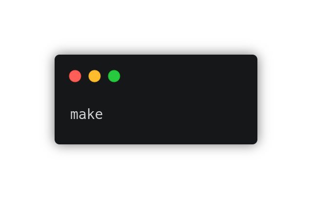
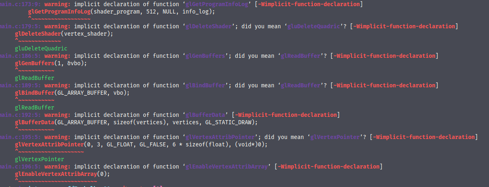
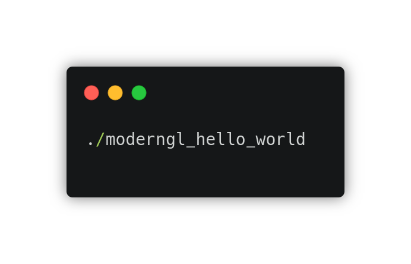
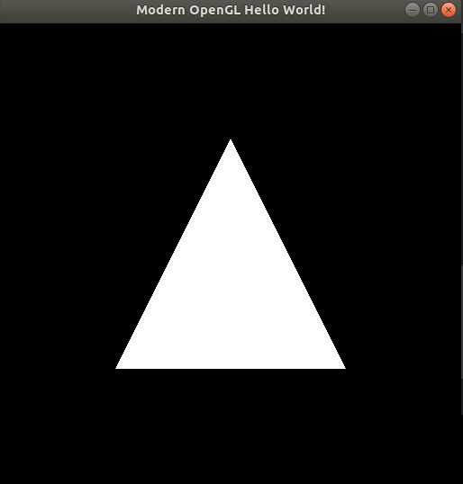
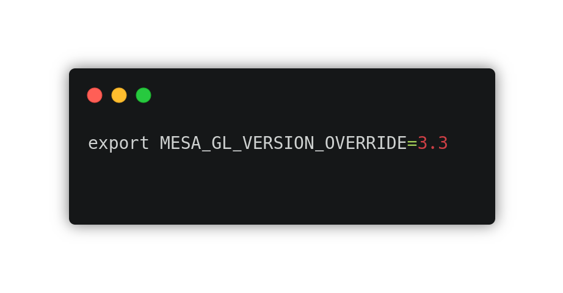
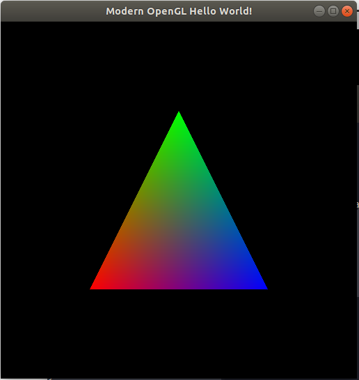

# Pratica II
## Compilando e Executando um Programa OpenGL Moderno

##### Objetivos

* Verificar se o ambiente de desenvolvimento em OpenGL 3.3 está corretamente configurado nos computadores dos alunos;
* Familizarizar os alunos com a estrutura de um programa OpenGL moderno

### Desenvolvimento

Após realizar a copia dos arquivos disponibilizados pelo Professor, os passos são simples.

O projeto já contem o arquivo Makefile para gerar o executavel, então executamos o comando make:

  

Como informado pelo professor, o console acusou alguns erros, mas nada que seja importante nesse momento.

  

Ao final da execução é gerado um arquivo executavel com nome <b>moderngl_hello_world</b>, então no console executamos esse arquivo usando o comando abaixo:

  

Em primeiro momento, caso a versão da MESA não esteja definida para a versão 3.3, nos deparamos com a imagem abaixo:

  

Porem, é simples de resolver o problema do triângulo branco, basta executar o comando abaixo no terminal:

  

Executando o arquivo <b>moderngl_hello_world</b> novamente pela linha de comando somos apresentado ao resultado esperado(Triângulo colorido), que é apresendo abaixo.

  

Assim é possivel garantir que tudo esta instalado corretamente.
