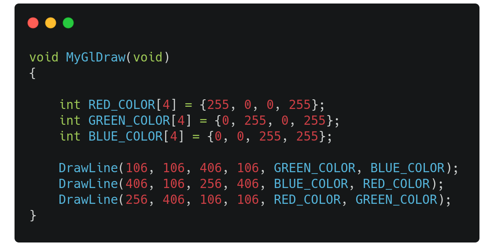

# Pratica II

## Compilando e Executando um Programa OpenGL Moderno

### Arthur Curty Vieira

##### Objetivos

O objetivo deste trabalho é a familiarização com os algoritmos de rasterização utilizados em computação gráfica.

#### O framework

##### Estrutura

Este framework simula o acesso direto à memória de vídeo. Os seus arquivos podem ser
acessados no <a href="https://github.com/capagot/icg/tree/master/02_mygl_framework">repositório disponibilizado pelo professor.
</a>

Abaixo segue a lista de arquivos que compõem este framework:

- core.h
- main.c
- main.h
- Makefile
- mygl.c
- mygl.h

Os arquivos main.h e main.c definem funções e variáveis necessárias a simulação de acesso à memória de vídeo. Este framework é acompanhado também de um script Makefile que serve como sugestão de procedimento de compilação para sistemas Unix. A compilação do framework é, de qualquer forma, responsabilidade do aluno.

Os arquivos mygl.h e mygl.c são os únicos arquivos que devem ser alterados durante a realização deste exercício. O arquivo mygl.h contém a declaração da função MyGlDraw(), responsável por invocar as funções de rasterização que os alunos irão desenvolver. É neste arquivo também os alunos deverão declarar as funções a serem desenvolvidas. O arquivo mygl.c é o lugar onde serão definidas as funções de rasterização. Este arquivo contém também a definição da função MyGlDraw(), cujo corpo o aluno deverá alterar de forma que suas funções de rasterização sejam devidamente invocadas.

##### Dependências

A compilação do projeto exige que os cabeçalhos do OpenGL e a GLUT (The OpenGL Toolkit) estejam instalados.Como especificado na descrição do projeto.
O ambiente está

### Desenvolvimento

O objetivo é desenvolver, ao menos, as três funções abaixo:
 
  - <b>PutPixel(...)</b>: Rasteriza um ponto na memória de vídeo recebendo como parâmetros as
  coordenadas (x,y) do pixel na tela e sua cor (RGBA).
  - <b>DrawLine(...)</b>: Rasteriza uma linha na tela, recebendo como parâmetros as coordenadas dos seus vértices inicial e final (representados respectivamente pelas tuplas (x0,y0) e (x1,y1)) e as cores (no formato RGBA) de cada vértice. As cores dos pixels ao longo da linha rasterizada devem ser obtidas por meio de interpolação linear das cores dos vértices. O algoritmo de rasterização de linha a ser implementado deve ser o Algoritmo do Ponto Médio!
  - <b>DrawTriangle(...)</b>: Função que desenha as arestas de um triângulo na tela, recebendo como parâmetros as posições dos três vértices (x0,y0), (x1,y1) e (x2,y2) bem como as cores (RGBA) de cada um dos vértices. As cores dos pixels das arestas do triângulo devem ser obtidas através da interpolação linear das cores de seus vértices. Não é necessário o preenchimento do triângulo!

Iniciando o desenvolvimento pela composição da função PutPixel(), que está apresenta abaixo:

  

Após a impementação, foi possivel testar chamando a função passando as coordenadas que devem ter as cores que foram passadas também como parâmetro.

  

Tendo como resultado a visualização abaixo:

  

O passo seguinte foi a crição da função DrawLine(), que foi criada recebendo os parâmetros abaixo, porem por ser a maior função, não vai ser apresentada como as anteriores.

  

A função possui ainda uma chamada para a função abaixo, que é responsavel por retornar o valor da distancia entre dois vertices.

  

Pós implementação, chmando a função, considerando que o eixo Y contem 511px e o eixo X tambémconte 511px, a formação do triangulo foi estipulada para ser centralizada, sendo assim pelos calculos os vestices seriam nos pontos (106,106), (406,406), (256,406). Usando a função DrawLine(), passando os vertices mencionados e suas respectivas cores, como é apresentado a baixo:

  

feito isso, as imagens abaixo representam a sequência de linhas que foram apresentas até a finalização do triangulo completo.

  

  

  

Finalizando assim o resultado esperado, mesmo que manualmente. Mas para que o objetivo seja alcançado ainda temos que implementar a função DrawTriangle(), que tem como intuito receber os 3 vertices, suas cores e criar no formato do triangulo como executado manualmente, alem de respeitar a regra definida de que as cores dos vertices devem ser iguais onde se encontram.

  

Feito isso, ao executar o comando abaixo:

Assim o arquivo executavel <b>mygl</b> é gerado e executado em sequência, apresentado ao fim o resultado final esperado, que é o triângulo completo.

  

##### Probleas encontrados

Durante a execução do programa, alguns erros foram encontrados que não permitiam a geração do executavel, a solução foi a inclusão no arquivo MakeFile, da flag -lm. Tendo como resultado final o seguinde formato de arquivo:

  

#### Referências

https://pt.wikipedia.org/wiki/Rasteriza%C3%A7%C3%A3o
https://askubuntu.com/questions/527665/undefined-reference-to-symbol-expglibc-2-2-5
http://disciplinas.ist.utl.pt/leic-cg/textos/livro/Rasterizacao.pdf
http://letslearnbits.blogspot.com/2014/10/icgt1-algoritmo-de-bresenham.html
https://letslearnbits.blogspot.com/2014/10/icgt1-interpolacao-de-cores.html
