# Pratica III

## Implementação do Pipeline Gráfico

### Arthur Curty Vieira

---

##### Objetivos

O objetivo deste trabalho é a familiarização com a estrutura do pipeline gráfico através da implementação das transformações geometricas que o compõem. Implementação será feita com auxílio da biblioteca <b><i>glm</i></b> e sua execução ocorrerá nos <i>shaders</i> do OpenGL.

##### Estrutura

Para esta atividade foi disponibilizado um código template pelo professor, que pode ser acessado no <a src="https://github.com/capagot/icg/tree/master/03_transformations">repositório da disciplina</a>.

##### Dependências

Com explicado na descrição do traalho, o código disponibilizado depende de software de terceiros, como as bibliotecas <a src="https://glm.g-truc.net/0.9.9/index.html">GLM</a> e <a src="http://glew.sourceforge.net/">GLEW</a>.

---

### Desenvolvimento

#### Atividade

A atividade consiste em se alterar, no programa template, os conteúdos das matrizes <b>MModel</b>, <b>MView</b> e <b>MProjection</b> de forma que o programa gere as imagens apresentadas na pré apresentação de cada exercicio.

##### Exercício 1: Escala

Este exercicio tem como objetivo modificar a matriz MODEL de forma que a imagem original geerada pelo programa seja transformada na imagem abaixo:

 

    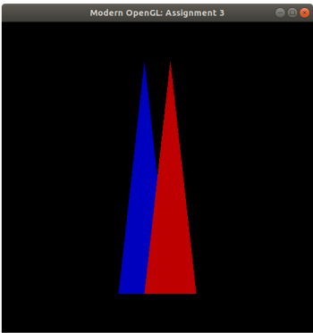
  

Fatores escala em (x, y, z) = ( 1/3 , 3/2 , 1). Com isso a matriz modificada fica da seguinte forma:

 

    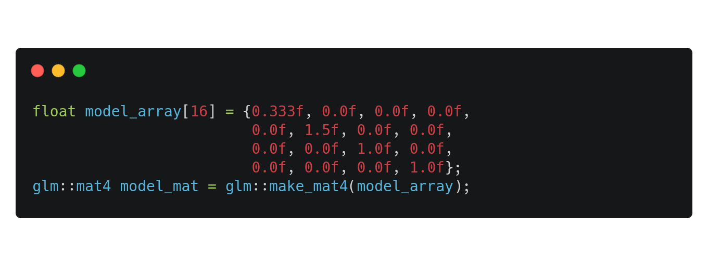
  

Tendo como saída ao compilar e executar o projeto a seguinte imagem:

 

    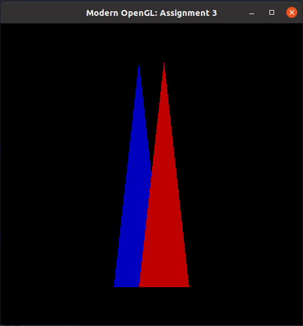
  

##### Exercício 2: Translação

Este exercício deve ser feito mantendo-se distorção perspectiva implementada na matriz
<b>MProjection</b> durante a realização do exercício anterior. De forma que a imagem geerada anteriormente pelo programa seja transformada na imagem abaixo:

    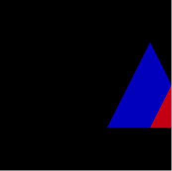
  

Com translação (x, y, z) = (1, 0, 0). Com isso passamos a ter a seguinte matriz:

    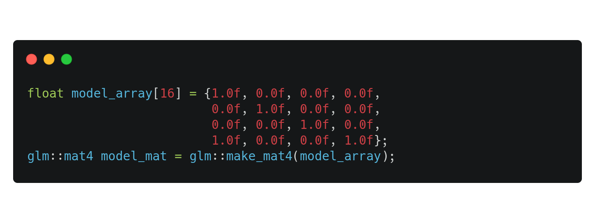

Tendo como saída ao compilar e executar o projeto a seguinte imagem:

    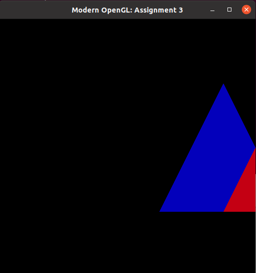

##### Exercício 3: Projeção Perspectiva

Modificar a matriz <b>MProjection</b> de forma que a imagem gerada pelo programa fique como a da figura apresenta abaixo:

    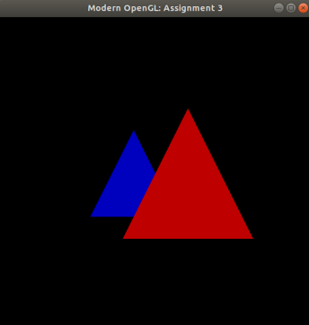

A matriz de projeção <b>MProjection</b> a ser utilizada é a que estudamos em aula e que considera a câmera na origem do seu sistema de coordenadas:

    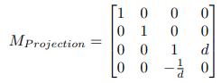

Considerando d a distância do centro de projeção até a origem do sistema de coordenadas da câmera, considerando ainda d = 1/2, temos a seguinte matriz:

    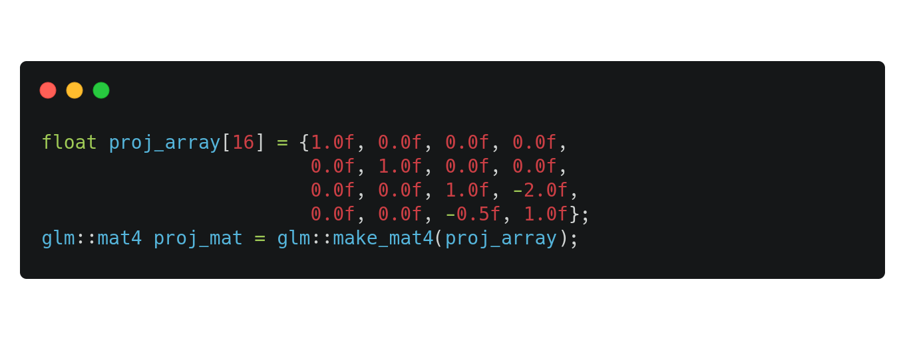

Tendo como saída ao compilar e executar o projeto a seguinte imagem:

    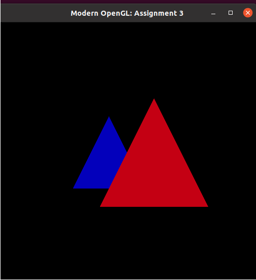

##### Exercício 4 - Posição da Câmera

Neste exercício é necessário modificar a matriz <b>MView</b> de forma que a imagem gerada seja igual a imagem a seguir:

    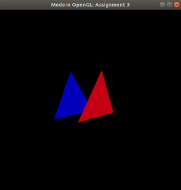

Sendo assim necessário a transformação do espaço do universo para o da câmera, com o objetivo de levar os vértices do objeto para o da câmera, assim realizando a mudança de base.
Para o processo é necessário definir a posição da câmera no espaço por meio de vetores no sistema ortogonal:

- Posição da Câmera (-1/10 , 1/10, 1/4) ;
- Direção da Câmera (0, 1, 0);
- Up Vector (0, 0, 0).

A Mview que será a matriz resultante da multiplicação da base transposta pela matriz de translação. Como apresentado nas fontes a seguir:

  

    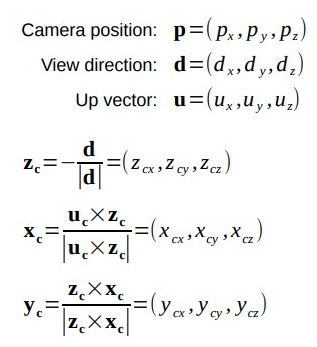
    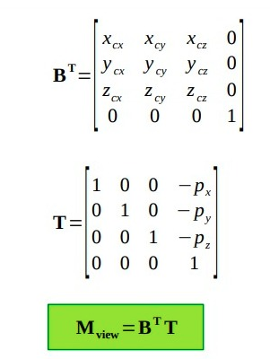    
  

Visto isso, a implementação fica da seguinte forma:

 

    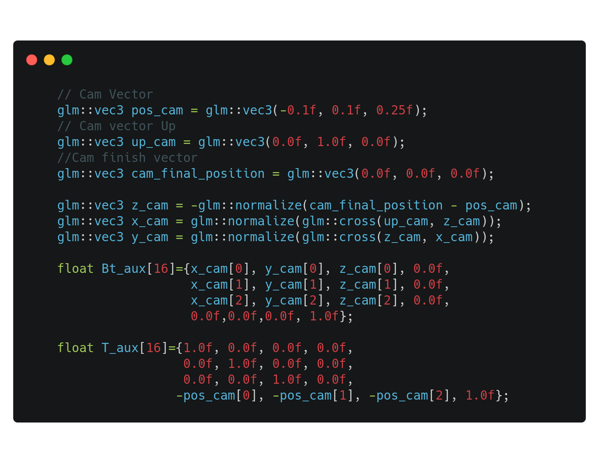       
 

Alterando assim a forma de recebimento do resutlado final de view_mat para a forma abaixo:

 

    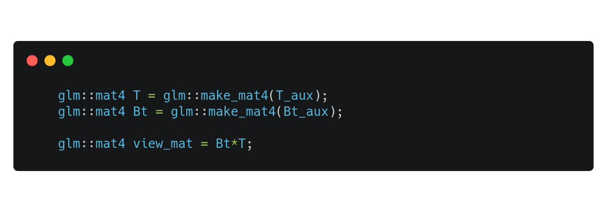       
 

Tendo como saída ao compilar e executar o projeto a seguinte imagem:

    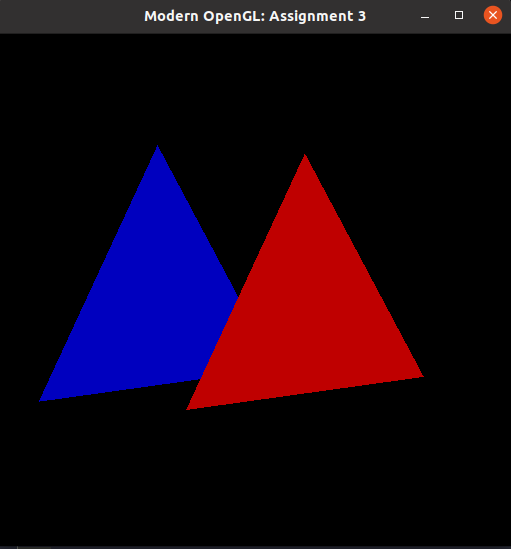

##### Exercício 5 - Transformações Livres

Para a transformação livre devemos alterar todas as 3 matrizes, Matriz Model, Matriz View e MAtriz Projection com intuito de encontrar um resultado diferetente dee qualquer uma das outras que foram feitas anteriormente.

Visto isso, alterando as matrizes da seguinte forma:

    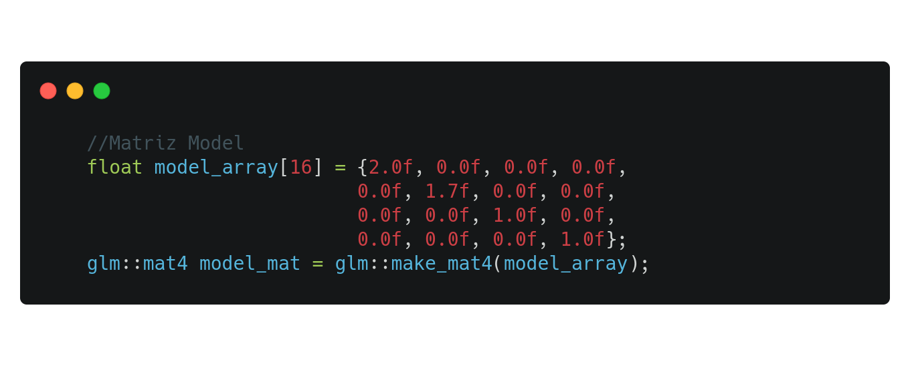

    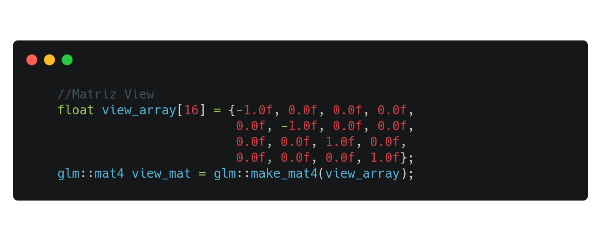

    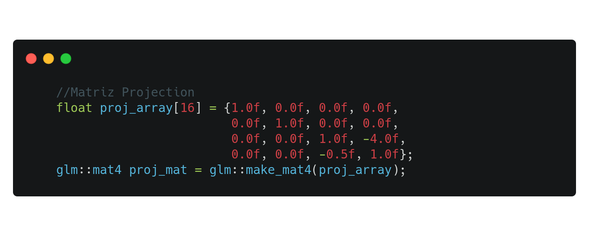

Tendo como saída ao compilar e executar o projeto a seguinte imagem:

    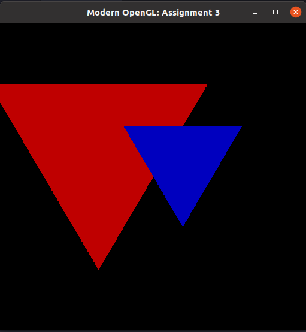

---

#### Probleas encontrados

  

  Para o ubuntu, foi necessário instalar o glew via linha de comando suando o comando:

  

    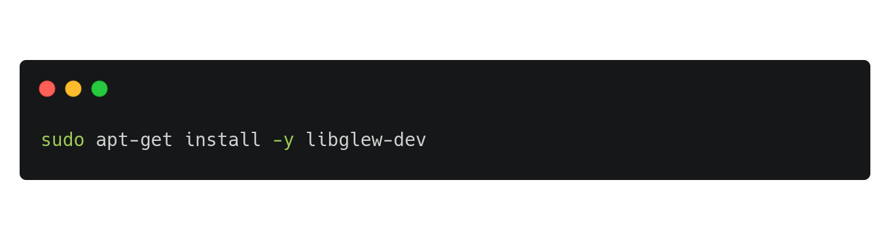
  

  Para além disso, por ter formatado o sistema recentemente tive que configurar novamente todo o ambiente.

#### Referências

- https://glm.g-truc.net/0.9.9/index.html
- http://glew.sourceforge.net/
- Slides da aula, disponibilizados via sigaa
